# Workflow State Diagram

> Full Mermaid flowchart for the Multi-Agent Orchestration Workflow **v2.2.0**.
> Rendering: paste this into any Mermaid-compatible viewer (GitHub, Mermaid Live, Obsidian).
> Diagram node labels are in Chinese; the surrounding documentation is English.
>
> v2.2.0 key change: **one worktree per feature**. The coordinator stays on the
> main branch for the entire run (never `git checkout`); every sub-task executes
> inside a single shared feature worktree on one `feature/<slug>` branch based on
> `origin/main`, and the feature ships as ONE PR. Parallelism safety comes from
> per-sub-task `owns` file-ownership globs — same-wave sub-tasks must have
> disjoint `owns`, validated during plan review — and dispatch happens in DAG
> **waves**: a dependent sub-task starts only after ALL its parents reach
> verdict=PASS, seeing their committed code naturally in the shared worktree.
> Before the PR is created, a dedicated **integration review** (fresh read-only
> review terminal) reviews the whole feature: plan, per-sub-task verdicts, test
> results, and `git diff origin/main...HEAD`.

```mermaid
graph TD
    Start([用户发起请求]) --> Meet[主 Agent @main: 需求对接<br/>全程不离开 main 分支]
    Meet --> Q1{信息是否清晰?}
    Q1 -->|否| Ask[向用户追问]
    Ask --> Meet
    Q1 -->|是| DocGen[方案 Agent: 生成技术方案<br/>产物以文本传递, 不落盘 main]

    subgraph PlanLoop [方案审核循环: 最多 3+2 轮]
        DocGen --> Review[Review Agent 审方案<br/>含 owns 不相交校验]
        Review --> Q2{通过? 轮次 ≤ 3}
        Q2 -->|否, 未超限| Fix[修改方案, 附 Review 意见]
        Fix --> Review
        Q2 -->|超限| Escalate[升级人工, 说明分歧点]
        Escalate --> EscCnt{人工介入 ≤ 2 次?}
        EscCnt -->|是| DocGen
        EscCnt -->|否| Terminate1[❌ 终止: 方案无法收敛]
    end

    Q2 -->|是| Confirm[向用户确认方案]
    Confirm --> Q3{用户确认? 最多 3 次}
    Q3 -->|不通过, 未超限| Feedback[收集反馈]
    Feedback --> DocGen
    Q3 -->|不通过, 超限| ForceChoice{强制决策}
    ForceChoice -->|继续修改| DocGen
    ForceChoice -->|终止| Terminate2[❌ 终止: 方向偏差过大]
    Q3 -->|通过| Plan[主 Agent: 拆解子任务<br/>每个声明 deps + owns 文件所有权]
    Q3 -->|Abort 任意轮次| Terminate2

    Plan --> BranchExist{同名 worktree 已存在?<br/>崩溃恢复场景}
    BranchExist -->|是, 复用恢复| Dispatch
    BranchExist -->|否| CreateWT[创建 feature worktree<br/>base = origin/main]
    CreateWT --> Dispatch[按 DAG 波次分发:<br/>无依赖先并行, 有依赖等父任务通过]

    subgraph ParallelExec [执行阶段: 同一 worktree, owns 不相交]
        Dispatch --> Sub1[子任务 1 执行<br/>完成后 commit 到 feature 分支]
        Sub1 --> SubReview1[新开 Review Agent<br/>只审该子任务的 commit 范围]
        SubReview1 --> SubCheck1{通过? ≤ 3 轮}
        SubCheck1 -->|否| SubFix1[新开 Fix Agent<br/>附 review 意见]
        SubFix1 --> SubReview1
        SubCheck1 -->|超限| SubFail1[标记失败 + 原因]
        SubCheck1 -->|是| SubDone1[✅ 子任务 1]

        Dispatch --> Sub2[子任务 2 执行<br/>完成后 commit]
        Sub2 --> SubReview2[新开 Review Agent]
        SubReview2 --> SubCheck2{通过? ≤ 3 轮}
        SubCheck2 -->|否| SubFix2[新开 Fix Agent]
        SubFix2 --> SubReview2
        SubCheck2 -->|超限| SubFail2[标记失败 + 原因]
        SubCheck2 -->|是| SubDone2[✅ 子任务 2]
    end

    SubDone1 --> Collect[主 Agent: 收集全部结果<br/>check --wait 滚动等待]
    SubFail1 --> Collect
    SubDone2 --> Collect
    SubFail2 --> Collect

    Collect --> AllOK{全部通过?}
    AllOK -->|是| Prep
    AllOK -->|否| RetryDecision{重试策略?<br/>全局 ≤ 2 轮}
    RetryDecision -->|重试失败项, 新建 task| Dispatch
    RetryDecision -->|降级交付| PartialOK[revert 失败子任务的 commits<br/>PR 标注缺失项]
    RetryDecision -->|超限| EscalateSub[升级人工]
    EscalateSub --> HumanSubDecision{人工决策}
    HumanSubDecision -->|指定方向| Dispatch
    HumanSubDecision -->|接受部分交付| PartialOK
    HumanSubDecision -->|放弃| Terminate3[❌ 终止: 子任务无法完成]
    PartialOK --> Prep

    Prep[主 Agent: 变更摘要 + 在 feature worktree 跑项目测试]
    Prep --> Rebase[feature 分支 rebase 到 origin/main]
    Rebase --> Block{冲突?}
    Block -->|有| AutoFix[新开 Agent 自动解冲突<br/>≤ 2 次]
    AutoFix --> FixOK{解决?}
    FixOK -->|是| OverallReview
    FixOK -->|否| DeliverBlock[交付人工, 附冲突详情]
    DeliverBlock --> HumanSolve{人工处理}
    HumanSolve -->|已解决| OverallReview
    HumanSolve -->|放弃| Park
    Block -->|无| OverallReview

    subgraph FinalGate [合并前总体 Review: 新开 Agent, 与实现不同家]
        OverallReview[总体 Review Agent<br/>审 git diff origin/main...HEAD<br/>+ 测试结果 + 方案对照] --> OVQ{通过? ≤ 2 轮}
        OVQ -->|否| OVFix[新开 Fix Agent<br/>按 findings 修复并 commit]
        OVFix --> OverallReview
        OVQ -->|超限| OVEsc[升级人工: 放行或 park]
    end

    OVQ -->|是| CreatePR[gh pr create --base main<br/>附变更摘要 + 总体 review 结论]
    OVEsc -->|人工放行| CreatePR
    OVEsc -->|park| Park

    CreatePR --> PRWait{PR 状态?<br/>人工 review}
    PRWait -->|有意见| FixPR[新开 Fix Agent<br/>push 到同一分支]
    FixPR --> PRWait
    PRWait -->|已合并| Cleanup[删除远端分支<br/>orca worktree rm + 关闭终端<br/>主 Agent 仅 git fetch]
    PRWait -->|被关闭| Park[保留分支/worktree<br/>写 .orca/parked/ 恢复指引]

    Cleanup --> Final[归档: 结果/产物/分支状态<br/>jq 原子更新 state 文件]
    Park --> Final
    Final --> Notify[通知用户, 附交付报告]
    Notify --> End([结束])
```

## State Transition Table

PARKED is a **feature-level** state in v2.2.0 (there is exactly one worktree,
branch, and PR per run). `MERGING` sub-steps run in the fixed order
`rebase → autofix → tests → integration-review → pr-create → pr-monitor`.

| From | Trigger | To | Guard |
|------|---------|----|-------|
| `INIT` | User request received; prerequisites verified | `GATHERING` | `orca status --json` ok; coordinator inside an Orca-managed checkout on `main` |
| `GATHERING` | Requirements clear | `PLANNING` | Q1 = yes |
| `GATHERING` | Clarification rounds exhausted | `TERMINATED` | > 5 rounds; user interaction only via the coordinator's native channel |
| `PLANNING` | Review-agent verdict = PASS (via `worker_done`) | `CONFIRMING` | Review is a separate dispatched task (never gate-create); checklist requires every sub-task to declare `owns` and same-wave `owns` to be disjoint |
| `PLANNING` | Review FAIL, rounds remain | `PLANNING` | Round ≤ MAX_REVIEW_ROUNDS (3); plan revised with review feedback, passed as text |
| `PLANNING` | Rounds exhausted, escalate to human | `PLANNING` | Escalations ≤ MAX_ESCALATE (2) |
| `PLANNING` | Escalations exhausted | `TERMINATED` | Terminate1 |
| `CONFIRMING` | User approves | `DISPATCHING` | — |
| `CONFIRMING` | User rejects, rounds remain | `PLANNING` | Round ≤ MAX_USER_CONFIRM (3); feedback carries back (Revise — no scope-reduction option) |
| `CONFIRMING` | User rejects, rounds exhausted | `TERMINATED` | Terminate2 |
| `CONFIRMING` | User aborts | `TERMINATED` | Immediate at ANY round (v2.2.0 off-by-one fix) |
| `DISPATCHING` | Same-name worktree found | `DISPATCHING` (resume) | `orca worktree list --json` matched by name — crash recovery; reuse, do not recreate |
| `DISPATCHING` | Worktree created + wave 0 dispatched | `EXECUTING` | `git fetch origin main` + `orca worktree create --name "<slug>" --base-branch origin/main`; state records worktree {id, path, branch_name, base_branch} |
| `DISPATCHING` | Worktree creation failed | `TERMINATED` | Infra-level failure |
| `EXECUTING` (wave w) | Every sub-task in wave w at verdict=PASS | `EXECUTING` (wave w+1) | A dependent sub-task dispatches only after ALL parents PASS; it sees parents' committed code in the shared worktree |
| `EXECUTING.sub-N` | Cross-review PASS | `EXECUTING` (waiting on wave) | Review covers only `<base_sha>..HEAD` within the sub-task's `owns`; reviewer ≠ implementer; fresh terminal per round |
| `EXECUTING.sub-N` | Review FAIL, rounds remain | `EXECUTING.sub-N` (round r+1) | Rounds 0..MAX_SUB_RETRY (1 initial + ≤ 3 retries); NEW task chained with `--parent` on a FRESH terminal — never re-dispatch the same task |
| `EXECUTING.sub-N` | Final round's review still FAIL | `EXECUTING.sub-N` (FAIL) | verdict=FAIL recorded with reason; siblings continue |
| `EXECUTING` | All sub-tasks reach a terminal verdict | `DECIDING` | Coordinator waits via rolling `check --wait`; a wait timeout is a liveness checkpoint, not a failure |
| `DECIDING` | All PASS | `MERGING` | AllOK = yes |
| `DECIDING` | Retry failed sub-tasks only | `DISPATCHING` | Allowed while global_retries_used < MAX_GLOBAL_RETRY (2), checked BEFORE incrementing — at most 2 retries |
| `DECIDING` | Degrade | `MERGING` | Coordinator reverts each failed sub-task's commit range in the feature worktree — clean because `owns` are disjoint; unclean revert → `PARKED` |
| `DECIDING` | Human aborts | `TERMINATED` | Terminate3 |
| `MERGING.rebase` | `git rebase origin/main` clean | `MERGING.tests` | Runs inside the feature worktree |
| `MERGING.rebase` | Conflicts | `MERGING.autofix` | ≤ MAX_AUTOFIX (2) attempts; fresh terminal resolves conflicts and runs `git rebase --continue` |
| `MERGING.autofix` | Rebase completed AND zero `^UU` files | `MERGING.tests` | SUCCESS requires both conditions — then break the loop |
| `MERGING.autofix` | Any autofix failure / attempts exhausted | human decision | Manual resolve → `MERGING.tests`; give up → `PARKED` |
| `MERGING.tests` | Project tests run in the worktree, results recorded | `MERGING.integration-review` | Results feed the integration-review spec |
| `MERGING.integration-review` | Verdict PASS | `MERGING.pr-create` | Fresh read-only review terminal; spec = plan + per-sub-task verdicts + test results + `git diff origin/main...HEAD` |
| `MERGING.integration-review` | Verdict FAIL, rounds remain | `MERGING.integration-review` (round r+1) | FRESH fix terminal applies findings and commits; ANOTHER fresh review terminal re-reviews; ≤ MAX_INTEGRATION_REVIEW (2) rounds |
| `MERGING.integration-review` | Rounds exhausted | human decision | Release anyway → `MERGING.pr-create`; park → `PARKED` |
| `MERGING.pr-create` | `gh pr create` exit code 0 | `MERGING.pr-monitor` | Body = change summary, artifacts, per-sub-task review rounds, integration-review verdict, ⚠️ degraded banner if applicable |
| `MERGING.pr-monitor` | Poll: `MERGED` | `CLEANING` | `gh pr view --json state,mergeStateStatus` every 60s; never gate-create inside the poll loop |
| `MERGING.pr-monitor` | Changes Requested | `MERGING.pr-monitor` (pr-fix round) | Fresh fix terminal → push to the same branch → keep monitoring |
| `MERGING.pr-monitor` | `CLOSED` | `PARKED` | Feature-level park |
| `PARKED` | Park manifest written | `CLEANING` | `.orca/parked/<feature-slug>.md`: branch, worktree path, PR url, reason, recovery steps; worktree + branch KEPT |
| `CLEANING` | Merged: remote branch deleted, worktree removed, keep_terminal closed | `CLEANING` (archive) | `git push origin --delete <branch>`; `orca worktree rm --worktree id:<id> --force`; every pr_state handled explicitly (OPEN at cleanup = guard/warn) |
| `CLEANING` | History appended, state finalized | `DONE` | ONE line to `.orca/workflow-history.jsonl`; state updates via jq atomic write (tmp file + mv); coordinator only runs `git fetch origin` afterwards |

## Termination Exits

| Exit | Trigger Condition | Feature State |
|------|------------------|---------------|
| **Terminate1** | Plan cannot pass review within 3 review rounds + 2 human escalations | No worktree ever created — plan was never approved; nothing to clean up |
| **Terminate2** | User rejects the plan 3 times, or aborts at any confirmation round | No worktree ever created — user disagreed with the direction |
| **Terminate3** | Sub-tasks still fail after global retries (≤ 2) and the human chooses abort | Passed sub-tasks' commits remain on the feature branch; worktree + branch disposition follows Phase 8 cleanup |
| **Feature-level PARKED** (recoverable) | Unclean degrade revert; rebase autofix exhausted + human parks; integration review exhausted + human parks; PR closed unmerged | Worktree + branch KEPT; `.orca/parked/<feature-slug>.md` records branch, worktree path, PR url, reason, recovery steps |
| **DONE** | PR merged (full or degraded delivery) | Remote branch deleted, worktree removed, keep_terminal closed, one history line appended to `.orca/workflow-history.jsonl` |
