# Workflow State Diagram

> Full Mermaid flowchart for the Multi-Agent Orchestration Workflow v2.0.0.
> Rendering: paste this into any Mermaid-compatible viewer (GitHub, Mermaid Live, Obsidian).

```mermaid
graph TD
    Start([User Request]) --> Meet[Phase 1: Requirements Gathering<br/>Coordinator analyzes request]
    Meet --> Q1{Is the request<br/>sufficiently clear?}
    Q1 -->|No| Ask[Ask clarifying questions<br/>orca orchestration ask]
    Ask --> Meet
    Q1 -->|Yes| DocGen[Phase 2: Plan Generation<br/>task-create + dispatch]

    subgraph PlanLoop ["Phase 2: Plan Review Loop (max 3 review rounds + 2 escalations)"]
        DocGen --> Review[Review Agent<br/>gate-create]
        Review --> Q2{Review passed?<br/>Round ≤ MAX_REVIEW_ROUNDS}
        Q2 -->|No, retries remain| Fix[Revise plan<br/>with review feedback]
        Fix --> Review
        Q2 -->|Retries exhausted| Escalate[Escalate to Human<br/>orca orchestration ask]
        Escalate --> EscCnt{Escalation count?}
        EscCnt -->|≤ MAX_ESCALATE| DocGen
        EscCnt -->|> MAX_ESCALATE| Terminate1["❌ TERMINATED<br/>Plan cannot converge<br/>Recommend human-led approach"]
    end

    Q2 -->|Yes| Confirm[Phase 3: User Confirmation<br/>Present plan summary]
    Confirm --> Q3{User approves?<br/>Round ≤ MAX_USER_CONFIRM}
    Q3 -->|No, retries remain| Feedback[Collect user feedback]
    Feedback --> DocGen
    Q3 -->|Retries exhausted| ForceChoice{Force decision}
    ForceChoice -->|Continue revising| DocGen
    ForceChoice -->|Terminate| Terminate2["❌ TERMINATED<br/>Directional misalignment<br/>too large to resolve"]
    Q3 -->|Yes| Plan[Phase 4: Task Decomposition<br/>Generate subtask DAG]

    Plan --> BranchExist{Worktree/branch<br/>already exists?}
    BranchExist -->|No| CreateBranch[Create feature branch<br/>orca worktree create]
    BranchExist -->|Yes, reuse| Dispatch
    CreateBranch --> Dispatch[Phase 4: Dispatch<br/>task-create + dispatch all subtasks]

    subgraph ParallelExec ["Phase 5: Parallel Execution (each subtask: max 3 internal retries)"]
        Dispatch --> Sub1[Worker 1: Research]
        Sub1 --> SubReview1[Self-Review]
        SubReview1 --> SubCheck1{Pass?<br/>Retries ≤ MAX_SUB_RETRY}
        SubCheck1 -->|No, retries remain| Sub1
        SubCheck1 -->|Retries exhausted| SubFail1[Mark FAIL + reason]
        SubCheck1 -->|Yes| SubDone1["✅ Artifact 1"]

        Dispatch --> Sub2[Worker 2: Writing]
        Sub2 --> SubReview2[Self-Review]
        SubReview2 --> SubCheck2{Pass?<br/>Retries ≤ MAX_SUB_RETRY}
        SubCheck2 -->|No, retries remain| Sub2
        SubCheck2 -->|Retries exhausted| SubFail2[Mark FAIL + reason]
        SubCheck2 -->|Yes| SubDone2["✅ Artifact 2"]

        Dispatch --> Sub3[Worker 3: Graphics]
        Sub3 --> SubReview3[Self-Review]
        SubReview3 --> SubCheck3{Pass?<br/>Retries ≤ MAX_SUB_RETRY}
        SubCheck3 -->|No, retries remain| Sub3
        SubCheck3 -->|Retries exhausted| SubFail3[Mark FAIL + reason]
        SubCheck3 -->|Yes| SubDone3["✅ Artifact 3"]
    end

    SubDone1 --> Collect[Phase 6: Collect All Results<br/>Wait for all workers done]
    SubFail1 --> Collect
    SubDone2 --> Collect
    SubFail2 --> Collect
    SubDone3 --> Collect
    SubFail3 --> Collect

    Collect --> Analyze[Phase 6: Analyze Results]
    Analyze --> AllOK{All subtasks<br/>passed?}
    AllOK -->|Yes| Prep
    AllOK -->|No| RetryDecision{Retry strategy?<br/>Global retries ≤ MAX_GLOBAL_RETRY}
    RetryDecision -->|Retry failed, retries remain| Dispatch
    RetryDecision -->|Degrade delivery| PartialOK[Mark: partial delivery<br/>Passed items shipped<br/>Failed flagged for manual]
    RetryDecision -->|Retries exhausted, escalate| EscalateSub[Escalate to Human<br/>orca orchestration ask]
    EscalateSub --> HumanSubDecision{Human decision}
    HumanSubDecision -->|Provide direction| Dispatch
    HumanSubDecision -->|Accept partial delivery| PartialOK
    HumanSubDecision -->|Abort| Terminate3["❌ TERMINATED<br/>Subtask(s) cannot<br/>be completed"]
    PartialOK --> Prep

    Prep[Phase 7: Generate Change Summary<br/>Artifacts, diffs, verification]

    Block{Merge pre-checks<br/>Conflicts? Permissions?}
    Block -->|Conflicts detected| AutoFix[Attempt auto-resolution<br/>max MAX_AUTOFIX attempts]
    AutoFix --> FixOK{Resolution<br/>successful?}
    FixOK -->|Yes| Block
    FixOK -->|No| DeliverBlock[Deliver to Human<br/>with conflict details]
    Block -->|Permission denied /<br/>validation failed| DeliverBlock
    Block -->|Passed| CreatePR[Phase 7: Create PR<br/>gh pr create]

    DeliverBlock --> HumanSolve{Human resolves}
    HumanSolve -->|Resolved| Block
    HumanSolve -->|Abort| Park

    CreatePR --> PRWait{PR status?}
    PRWait -->|Review feedback| FixPR[Address feedback<br/>push to same branch]
    FixPR --> PRWait
    PRWait -->|Merged| Cleanup[Phase 8: Cleanup<br/>orca worktree remove]
    PRWait -->|Closed| Park[Phase 8: Park<br/>Archive branch & worktree<br/>Write recovery manifest]

    Cleanup --> Final[Phase 8: Archive<br/>Record results & state]
    Park --> ArchiveWorktree[Archive worktree<br/>Release resources]
    ArchiveWorktree --> Final
    Final --> Notify[Notify User<br/>orca orchestration ask]
    Notify --> End([Done])
```

## State Transition Table

| From | Trigger | To | Guard |
|------|---------|----|-------|
| `INIT` | User request received | `GATHERING` | — |
| `GATHERING` | Requirements clear | `PLANNING` | Q1 = yes |
| `GATHERING` | Max clarifications | `TERMINATED` | > 5 rounds |
| `PLANNING` | Review passed | `CONFIRMING` | Q2 = yes |
| `PLANNING` | Rounds exhausted + escalate ≤ 2 | `PLANNING` | Escalate → retry |
| `PLANNING` | Escalate > 2 | `TERMINATED` | Terminate1 |
| `CONFIRMING` | User approves | `DISPATCHING` | — |
| `CONFIRMING` | User rejects (< 3) | `PLANNING` | With feedback |
| `CONFIRMING` | User rejects (≥ 3) | `TERMINATED` | Terminate2 |
| `DISPATCHING` | All dispatched | `EXECUTING` | — |
| `EXECUTING` | All workers done | `DECIDING` | — |
| `DECIDING` | All passed | `MERGING` | AllOK = yes |
| `DECIDING` | Retry (< 2) | `DISPATCHING` | Failed only |
| `DECIDING` | Degrade | `MERGING` | PartialOK set |
| `DECIDING` | Human aborts | `TERMINATED` | Terminate3 |
| `MERGING` | PR merged | `CLEANING` | — |
| `MERGING` | PR closed | `CLEANING` | Park flag |
| `CLEANING` | Done | `DONE` | — |

## Termination Exits

| Exit | Trigger Condition | Artifact State |
|------|------------------|---------------|
| **Terminate1** | Plan cannot pass review after 2 human escalations | No artifacts — plan was never approved |
| **Terminate2** | User rejects plan > 3 times | No artifacts — user disagreed with direction |
| **Terminate3** | Subtasks fail after global retry + human abort | Completed artifacts preserved; failure manifest written |
